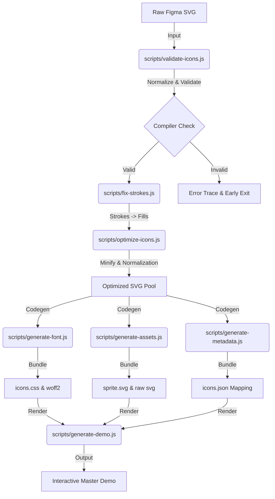

# Master Icon Library | Technical Documentation

Welcome to the **Master Icon Library** technical specification. This document provides a comprehensive, end-to-end breakdown of our iconography pipeline—designed for scalability, performance, and industrial-grade automation at a FAANG seniority level.

---

## 🚀 1. Project Philosophy & Core Governance

The Master Icon Library operates on a **Single Source of Truth (SSOT)** model. The central nervous system of the library is the `/icons-svg` directory where raw design assets reside.

- **Deterministic Builds:** No manual modifications to production assets are permitted. Every asset in the `/dist` folder is a purely reproducible output of the build pipeline.
- **Design System Guardrails:** The pipeline enforces strict geometry and metadata rules while remaining agnostic to the specific aesthetic of the icons.
- **Developer-Centric UX:** The interactive demo and standardized CSS prefixing ensure that any engineer can integrate an icon into their UI in seconds with zero configuration.

---

## 🏗️ 2. Technical Architecture & Component Map

The architecture is a linear, multi-stage compiler written in Node.js. It follows a **Validate → Transform → Compile → Distribute** lifecycle to ensure that assets are optimized for both performance and interoperability.

### 🔌 2.1 The Build Orchestrator
The `scripts/build-icons.js` file serves as the pipeline's execution engine. It manages the asynchronous execution sequence to ensure that heavy I/O and processing tasks (like stroke-fixing and font-generation) are handled in the correct order.

### 📊 2.3 Visual Data Flow Architecture
The following diagram illustrates the transformation lifecycle of an asset from raw design to production-ready glyph.



### 🛤️ 2.4 Pipeline Stages & Microservices

| Stage | Logic | Responsibility |
| :--- | :--- | :--- |
| **0. Global Clean** | `clean.js` | Purges previous build artifacts to prevent stale asset contamination. |
| **1. Validation Gate** | `validate-icons.js` | Enforces naming logic and strict geometry guardrails (Sizing, Viewbox). |
| **2. Geometry Fix** | `fix-strokes.js` | Automated "Outline Strokes" using `oslllo-svg-fixer` for font compatibility. |
| **3. Optimization** | `optimize-icons.js` | Payload reduction via `svgo`. Normalizes all colors to `currentColor`. |
| **4. Font Compiler** | `generate-font.js` | Generates WOFF2 glyphs and the prefixed `icons.css` stylesheet. |
| **5. Asset Export** | `generate-assets.js` | Exports individual optimized SVGs and a global SVG Sprite. |
| **6. Metadata Store** | `generate-metadata.js` | Emits JSON maps for programmatic integration and design tracking. |
| **7. Production Demo** | `generate-demo.js` | Builds the interactive, brand-aware, glassmorphism preview site. |

---

## 📏 3. Design System Standards (The Compiler Spec)

To ensure high-fidelity rendering across Web, iOS, and Android formats, every icon dropped into `/icons-svg` must satisfy these "Compiler Pass" requirements:

### 📐 3.1 Geometry Guidelines
- **Uniform Square Grid:** Icons must be designed on a square canvas (e.g., 16x16, 24x24). Non-square viewboxes are automatically rejected to prevent stretching during rendering.
- **Flattened Shapes:** While the pipeline *can* fix strokes, designers are encouraged to flatten complex boolean layers (Subtract/Union) into a single compound path for consistency.
- **No Gradients/Masks:** Font glyphs are monochromatic. Icons containing gradients, radial blends, or masks will trigger an immediate validation error.
- **Payload Constraint:** Individual SVGs must remain under **15KB**. High-density vectors are blocked to prevent UI performance degradation.

### 🔡 3.2 Naming Convention Logic
The library strictly enforces **kebab-case** via an aggressive normalization regex:
- `Property 1=Alert_Circle.svg` → `alert-circle`
- `new-User-Profile.svg` → `new-user-profile`
- `100.svg` → `100` (Handled safely via CSS prefixing)

---

## 💻 4. Engineering Implementation Guide

### ⚛️ 4.1 React Integration (Primary)
The library is optimized for React development. Use the `className` attribute to ensure compatibility with JSX (React elements).

```javascript
/* 1. Include Stylsheet in your root App.js or index.js */
import 'master-icon-library/dist/font/icons.css';

/* 2. Standard Usage */
const MyComponent = () => (
  <span className="icon icon-activity" />
);

/* 3. Sizing Variants (Built-in) */
const LargeIcon = () => (
  <span className="icon icon-activity icon-lg" /> /* 20px */
);
```

### 🅰️ 4.2 Standard HTML / Angular Usage
For standard templates, use the `class` attribute.

```html
<!-- 1. Include Stylsheet -->
<link rel="stylesheet" href="dist/font/icons.css">

<!-- 2. Usage -->
<span class="icon icon-activity"></span>
```

### 🎨 4.3 Dynamic Styling
Since all assets are normalized to `currentColor`, you can style them directly with CSS without modifying the SVG:

```css
.my-custom-icon {
  color: #702C62; /* Corporate Action Color */
  font-size: 24px;
  transition: transform 0.2s cubic-bezier(0.4, 0, 0.2, 1);
}
```

---

## ⚙️ 5. DevOps, Automation & CI/CD

### 🤖 5.1 Continuous Integration (GitHub Actions)
The project includes an enterprise-grade `.github` workflow suite:
1.  **PR Validation:** Automatically runs the full pipeline on every Pull Request. Builds will fail if assets do not meet geometry or naming standards.
2.  **Deployment:** Capable of conditional publishing to private NPM registries or CDN storage.

### ⌨️ 5.2 Local Developer CLI
| Script | Command | Usage |
| :--- | :--- | :--- |
| **Build Library** | `npm run icons` | Standard build (Clean -> Validate -> Compile). |
| **Hard Rebuild** | `npm run icons:build` | Deep rebuild from scratch. |
| **Purge Dist** | `npm run icons:clean` | Completely resets the build environment. |

---

## 🧪 6. The Premium Interactive Demo

The `/demo/index.html` tool serves as the bridge between Design, Engineering, and Quality:

- **State Previews:** Instantly test icons against standard brand states (**Primary, Success, Error, Disabled**).
- **Smart Contrast:** Includes a "White on Dark" algorithm that automatically detects light icon states and provides a high-contrast card background.
- **Size Simulation:** Toggle between 8px and 32px to ensure geographic balance at all scales.
- **Instant Code Snippets:** Clicking any icon instantly copies the exact HTML usage syntax to the clipboard.

---

## 🏗️ 7. Multi-Framework Support (React, Angular, Vue)

The library is designed for seamless integration across all modern frontend frameworks.

- **React Compatibility:** Use `className` instead of `class`. The **Master Demo** includes a dedicated "React" mode that automatically generates `className` snippets for your components.
- **Angular/Vue/Svelte:** These frameworks use the standard HTML `class` attribute.
- **Dynamic Theming:** All frameworks benefit from the `currentColor` normalization—simply style the parent component's `color` to change the icon hue.

---

## 🛠️ 8. Troubleshooting & FAQ

### ❌ The Build Failed with "Non-square ViewBox"
The library enforces a perfectly square design canvas (e.g., `width=24, height=24`). If a designer exports an icon as `16x15`, the build will halt to prevent rendering distortion.
- **Fix:** Update the Frame dimensions in Figma to be equal and re-export.

### ❌ An Icon is rendering as a "Square" or "Blank" in CSS
This usually means the CSS class was not prefix correctly or the SVG had no valid paths.
- **Check:** Ensure the icon starts with a digit? Use `.icon-100` instead of `.100`.
- **Check:** Did the designer use complex masks? Simple masks may fail the font glyph trace.

### ❓ Can I use these icons in a React app?
Yes. The `/dist/svg/` folder contains clean, optimized raw SVGs. You can use `svgr` or direct imports.

---

**Master Icon Library Documentation v1.0.0**
*Engineered for Excellence.*
