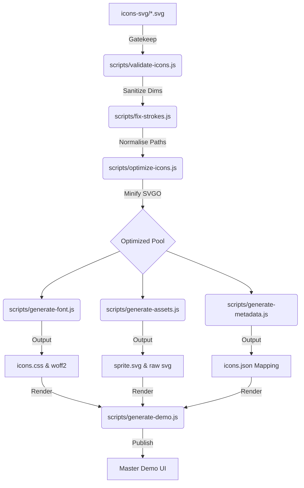
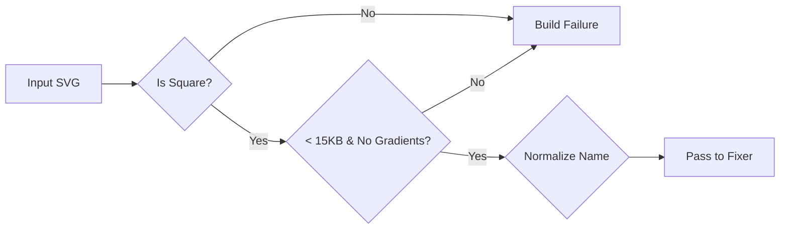

# Master Icon Library | Technical Architecture Spec

Welcome to the **Master Icon Library** technical documentation. This document serves as the primary engineering reference for the iconography compiler, asset distribution, and design-to-code workflow.

---

## 🚀 1. Architectural Philosophy

The library is designed around the concept of **Geometric Equivalence**. Regardless of the source asset's provenance (Figma, Illustrator, Sketch), the compiler ensures that the final output is normalized to a high-fidelity, predictable coordinate system.

### Core Principles
- **SSOT (Single Source of Truth):** Raw SVGs are the only source. All `dist` assets are reproducible artifacts.
- **Stateless Validation:** Every icon must pass a rigorous geometric audit before being merged into the font pool.
- **Zero-Conf Integration:** Developers can consume icons via simple class names with built-in variants for sizing and brand states.

---

## 🏗️ 2. Pipeline Architecture

The build pipeline is a resilient, multi-stage compiler that transforms raw vectors into optimized production assets.

### 2.1 Asset Transformation Lifecycle



### 2.2 Gatekeeping Logic (Validation Stage)



---

## 📏 3. Design System Standards

### 3.1 Geometric Constraints
- **Square ViewBox:** All icons must be designed on a square grid (e.g., 24x24).
- **Dimensional Sanitization:** The compiler strips root `width` and `height` to prevent coordinate bloating while preserving internal `mask` and `clipPath` dimensions.
- **Monochromatic Requirement:** Gradients and multi-color fills are automatically stripped. Design for `currentColor`.

### 3.2 Naming Logic
Assets are automatically normalized from Figma property strings to `kebab-case`:
- `Property 1=Add_User.svg` $\rightarrow$ `add-user`
- `new-UserProfile-Icon.svg` $\rightarrow$ `new-user-profile-icon`

---

## 🎨 4. Branding & Customization guide

### 4.1 Customizing Brand Colors
The library supports dynamic recoloring via CSS. You can modify the standard preview colors in [**scripts/generate-demo.js**](file:///c:/Users/VudumudiAshishRamaRa/OneDrive%20-%20PharmaForce%20Group%20LLC/Desktop/Icon/scripts/generate-demo.js) by adding or updating hex values in the `colorChips` group.

### 4.2 Scaling Interaction States
The Interactive Demo utilizes a scalable `data-active-state` architecture.

| State | Background | Border | Icon Color |
| :--- | :--- | :--- | :--- |
| **None** | Transparent | Transparent | `dynamic-color` |
| **Hover** | `#DBCAD8` (Light) | Transparent | `accent-color` |
| **Selected** | `#702C62` (Dark) | Transparent | `#FFFFFF` (White) |

**Adding New States:** To add a state like "Pressed", simply add a new CSS rule for `[data-active-state="pressed"]` and a corresponding button in the demo generator.

---

## 💻 5. Integration Guide

### React Mode (JSX)
The master demo includes a **Syntax Selector**. Ensure you are in **React Mode** to copy `className` based snippets.

```jsx
<span className="icon icon-activity" />
```

### HTML Mode
Standard usage for non-JSX environments.

```html
<span class="icon icon-activity"></span>
```

---

**Master Icon Library Documentation v1.0.0**
*Engineered for Excellence and Scalability.*
