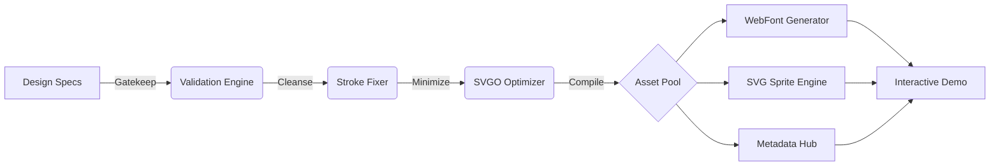

# 💎 Master Icon Library 

[]()
[]()
[]()

An enterprise-grade, automated iconography pipeline that serves as a single source of truth for SVG and font-based icon distribution. Engineered for strict design-system compliance and multi-framework interoperability.

---

## ✨ Key Features

*   **⚡ Automated Optimization**: Built-in SVG compiler that handles stroke-to-path conversion, payload minification, and geometry normalization.
*   **🛡️ Geometric Gatekeeping**: Strict validation layers prevent non-square, oversized, or complex assets from entering the production build.
*   **🎨 CSS-Driven Theming**: All icons are normalized to `currentColor` for instant CSS styling. No hardcoded brand styles.
*   **⚛️ Framework First**: Native support for **React (`className`)**, Angular, and Vue.
*   **🎭 Premium Interactivity**: Includes a glassmorphism master demo with live state previews (Hover, Selected) and one-click code extraction.

---

## 🏗️ High-Level Architecture



---

## 🚀 Quick Start

### Installation
```bash
npm install
```

### Build the Library
```bash
npm run icons
```

---

## 💻 Usage

### React (Primary)
```jsx
// 1. Import CSS in root
import 'master-icon-library/dist/font/icons.css';

// 2. Implementation
<span className="icon icon-activity" />
```

### SVG Sprite (Performance)
```html
<svg class="icon"><use xlink:href="dist/sprite/sprite.svg#activity"></use></svg>
```

---

## 📖 Extended Documentation

For a deep-dive into the technical architecture, design system specifications, and customization guides, please refer to the [**Technical Documentation**](./DOCUMENTATION.md).

---

**© 2026 Enterprise Icon Pipeline Team**
*Engineered for Excellence.*
